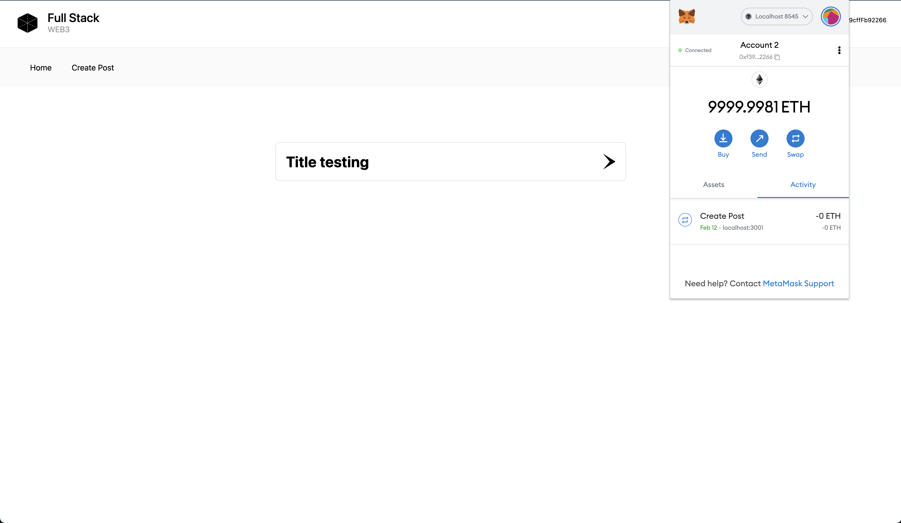
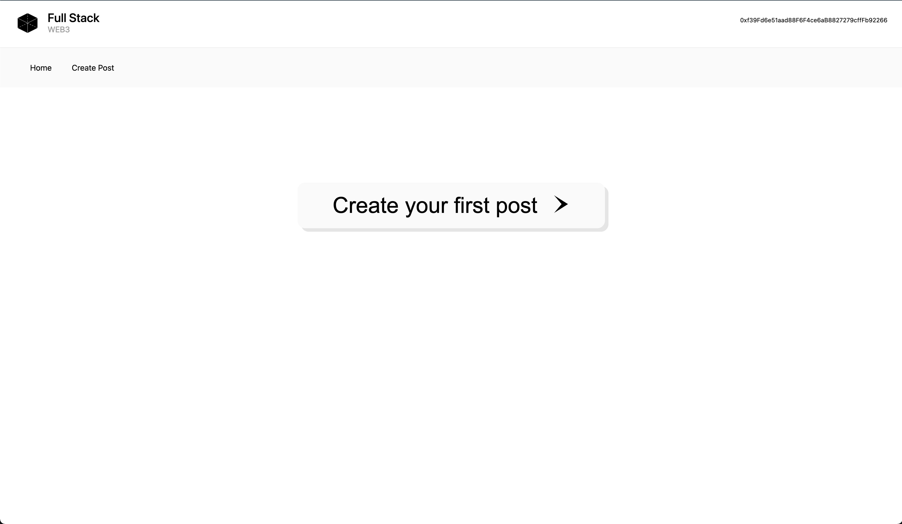
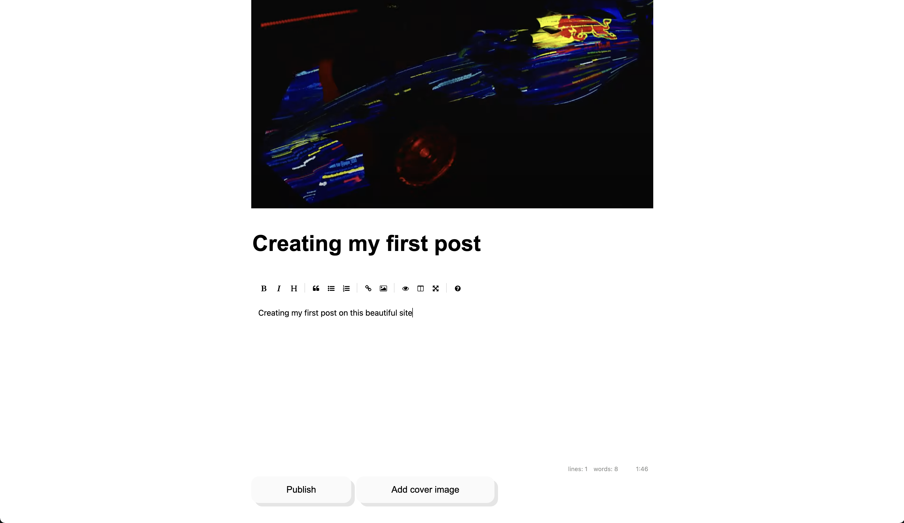
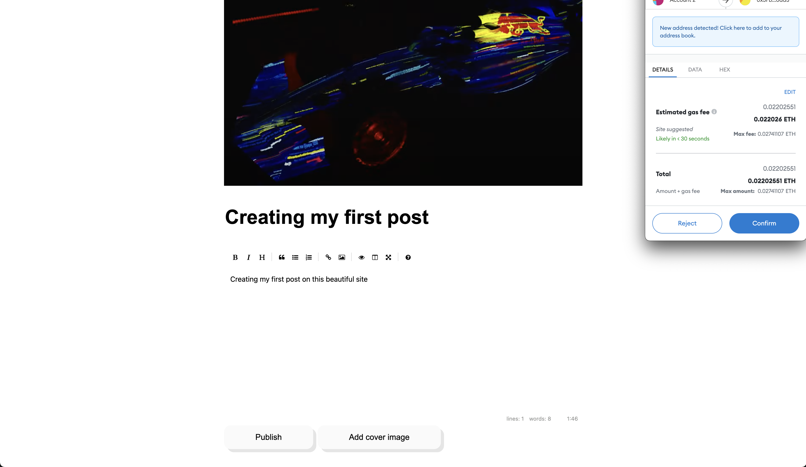

# Social Network in Web3 and Blockchain

With the ascending concern about web3 and the promises of it being the future of humanity, I've decided to study the field and start to create projects to get the shape of the so call "biggest turn in the web"

## NPM Commands

#### Install dependencies

```js
npm install
```

#### First of all, run the Hardhat and get the fake Ether accounts

(Do this in another Terminal, we need two terminal screens to run this project)

```js
npx hardhat node
```

#### Deploy your script to the network

(To have better test results, test it in localhost. I'm leaving a .env.local to run local stuff)

```js
npx hardhat run scripts/deploy.js --network localhost
```

#### Run the app

```js
npm run dev
```

## Author

- [@zagoguic](https://www.github.com/mecbonjourno)

## Stack

**Front-end:** React, NextJs

**Back-end:** Node, HardHat, Polygon Network, Solidity

## Screenshots





